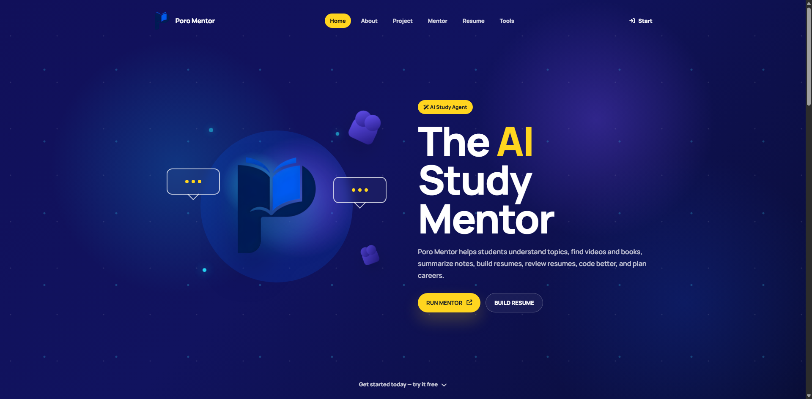
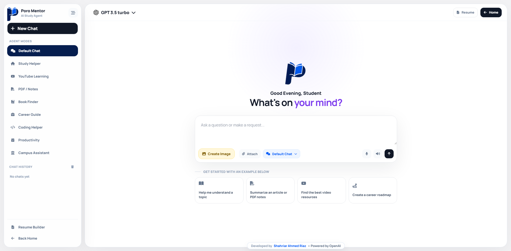
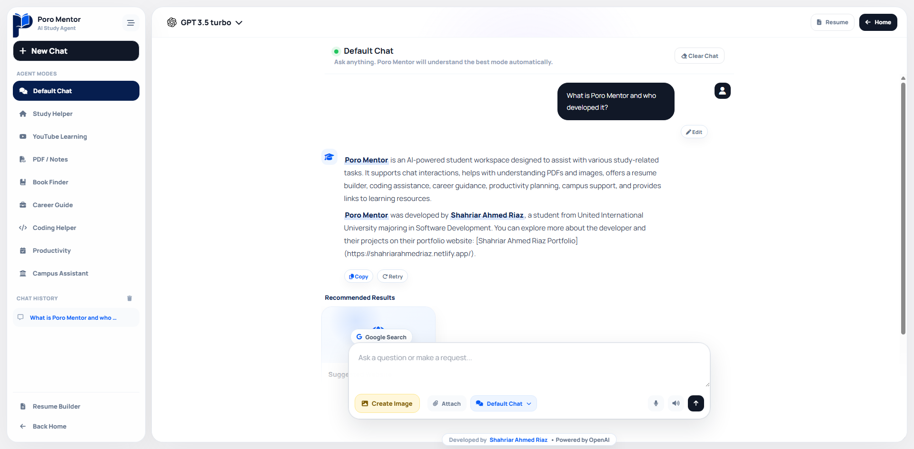
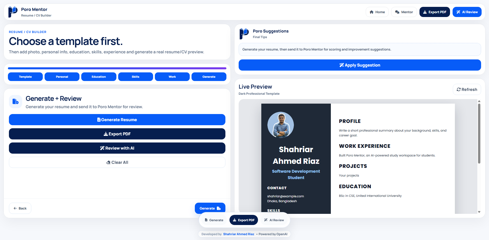
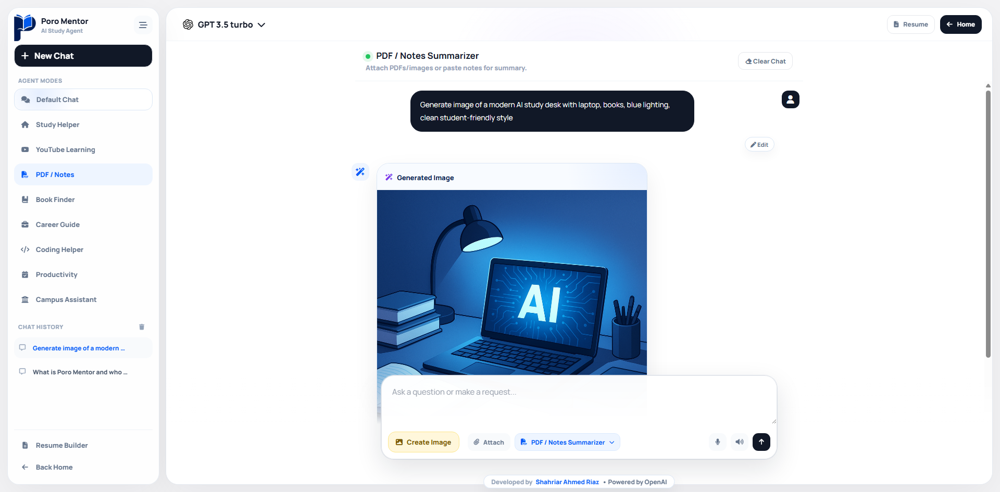

<div align="center">


# 📘✨ Poro Mentor

### AI-Powered Study Workspace for Students


<br/>


<br/>

<a href="YOUR_LIVE_DEMO_LINK">
  
</a>
<a href="YOUR_DEMO_VIDEO_LINK">
  
</a>
<a href="https://shahriarahmedriaz.netlify.app/">
  
</a>

</div>

---

## 🌟 Project Overview

**Poro Mentor** is an AI-powered student workspace built to help students learn faster, plan better, and work smarter.

It combines **AI chat**, **study assistance**, **PDF/image understanding**, **resume building**, **career guidance**, **coding help**, **productivity planning**, **resource discovery**, and **AI image generation** inside one clean, student-friendly web app.

> A complete AI companion for students — from learning to career preparation.

---

## 🎯 Problem

Students often use many separate tools for:

| Student Need | Common Problem                                                   |
| ------------ | ---------------------------------------------------------------- |
| Studying     | Hard to understand complex topics quickly                        |
| Notes/PDFs   | Long documents take too much time to summarize                   |
| Resume       | Many students do not know how to structure a professional resume |
| Career       | Students need roadmaps, project ideas, and skill guidance        |
| Coding       | Debugging and learning programming concepts can be confusing     |
| Resources    | Finding good learning links takes time                           |
| Visuals      | Students need posters, thumbnails, and study visuals             |

**Poro Mentor solves this by bringing all these workflows into one AI-powered platform.**

---

## 🚀 Key Features

| Feature                     | Description                                                                                                          |
| --------------------------- | -------------------------------------------------------------------------------------------------------------------- |
| 💬 **Default Chat**         | Normal GPT-style assistant mode for general questions                                                                |
| 📚 **Study Helper**         | Explains topics, creates notes, key points, quizzes, and flashcards                                                  |
| 📄 **PDF Understanding**    | Upload PDFs and ask questions or summarize content                                                                   |
| 🖼️ **Image Understanding** | Upload images and get AI-based explanation or analysis                                                               |
| 📎 **Multi-file Upload**    | Upload multiple PDFs/images with custom instruction                                                                  |
| 🧾 **Resume Builder**       | Step-by-step resume builder with live preview                                                                        |
| 🤖 **AI Resume Review**     | AI suggestions to improve resume quality                                                                             |
| 💼 **Career Guide**         | Roadmaps, skills, projects, and learning plans                                                                       |
| 👨‍💻 **Coding Helper**     | Code explanation, debugging help, and resource links                                                                 |
| ✅ **Productivity Planner**  | Study routines, exam preparation plans, and task breakdown                                                           |
| 🎓 **Campus Assistant**     | Student support for academic and campus-related questions                                                            |
| 🎨 **AI Image Generation**  | Generate posters, thumbnails, banners, diagrams, and visuals                                                         |
| 🔗 **Resource Discovery**   | Valid links for YouTube, Khan Academy, Open Library, Google Scholar, MDN, GitHub, Stack Overflow, Coursera, and more |
| 🧠 **Model Selector**       | GPT model dropdown loaded from API-supported OpenAI models                                                           |
| 🕘 **Chat History**         | Local chat history with delete, edit, retry, and copy options                                                        |

---

## 🧩 Pages

| Page           | Purpose                         |
| -------------- | ------------------------------- |
| `index.html`   | Landing page                    |
| `mentor.html`  | Main AI mentor workspace        |
| `resume.html`  | Resume builder                  |
| `about.html`   | About and documentation         |
| `project.html` | Hackathon project documentation |

---

## 🛠️ Tech Stack

<div align="center">

| Frontend     | Backend     | AI               | Tools         |
| ------------ | ----------- | ---------------- | ------------- |
| HTML5        | Node.js     | OpenAI API       | Font Awesome  |
| CSS3         | Express.js  | GPT Models       | Google Fonts  |
| JavaScript   | Multer      | Image Generation | AOS Animation |
| LocalStorage | PDF Parsing | Multimodal AI    | GitHub Ready  |

</div>

---

## 🔌 Backend API Endpoints

| Method | Endpoint              | Purpose                               |
| ------ | --------------------- | ------------------------------------- |
| `GET`  | `/api/health`         | Checks server health                  |
| `GET`  | `/api/models`         | Loads available GPT models            |
| `POST` | `/api/agent`          | Main AI mentor/chat endpoint          |
| `POST` | `/api/agent-files`    | Multiple PDF/image upload with prompt |
| `POST` | `/api/pdf`            | Single PDF summarization endpoint     |
| `POST` | `/api/image`          | Single image analysis endpoint        |
| `POST` | `/api/generate-image` | AI image generation endpoint          |

---

## 🧠 OpenAI Usage

Poro Mentor uses OpenAI for:

| AI Workflow      | Description                                             |
| ---------------- | ------------------------------------------------------- |
| Chat Assistant   | General student conversation and problem solving        |
| Study Help       | Topic explanation, notes, quizzes, flashcards           |
| PDF Analysis     | Summarization and question answering from uploaded PDFs |
| Image Analysis   | Understanding uploaded images                           |
| Resume Review    | Feedback and improvement suggestions                    |
| Coding Help      | Programming explanation and debugging                   |
| Career Guidance  | Learning roadmap and skill planning                     |
| Model Listing    | Loads supported GPT models                              |
| Image Generation | Creates posters, thumbnails, banners, and study visuals |

---

## 📸 Screenshots

<div align="center">

| Landing Page | Mentor Workspace |
|---|---|
|  |  |

| AI Answer | Resume Builder |
|---|---|
|  |  |

| AI Image Generation |
|---|
|  |

</div>

---

## ⚙️ Installation

### 1. Clone the repository

```bash
git clone YOUR_GITHUB_REPO_LINK
cd poro-mentor
```

### 2. Install dependencies

```bash
npm install
```

### 3. Create `.env`

Create a `.env` file in the root folder:

```env
OPENAI_API_KEY=your_openai_api_key_here
PORT=3000
```

### 4. Run development server

```bash
npm run dev
```

### 5. Open in browser

```text
http://localhost:3000
```

---

## 📁 Project Structure

```text
poro-mentor/
│
├── public/
│   ├── assets/
│   │   └── img/
│   │       └── poroai_nobg.png
│   ├── generated/
│   │   └── .gitkeep
│   ├── index.html
│   ├── mentor.html
│   ├── resume.html
│   ├── about.html
│   ├── project.html
│   ├── style.css
│   ├── mentor.css
│   ├── resume.css
│   ├── mentor.js
│   ├── resume.js
│   └── common.js
│
├── uploads/
│   └── .gitkeep
│
├── server.js
├── package.json
├── .env.example
├── .gitignore
├── README.md
└── LICENSE
```

---

## 🏆 Hackathon Value

| Judging Area             | How Poro Mentor Stands Out                                                                 |
| ------------------------ | ------------------------------------------------------------------------------------------ |
| Innovation               | Combines multiple student workflows in one AI workspace                                    |
| Impact                   | Helps students study, prepare careers, build resumes, and learn faster                     |
| Technical Implementation | Uses Express backend, OpenAI APIs, multimodal uploads, image generation, and model listing |
| User Experience          | Clean modern UI with agent modes, history, file upload, and resume preview                 |
| Scalability              | Can expand into cloud accounts, campus systems, real APIs, and mobile app                  |

---

## 🔮 Future Improvements

* User login and cloud chat history
* Real YouTube API result thumbnails
* University-specific campus assistant
* Collaborative study rooms
* Mobile app version
* Cloud resume storage
* Voice conversation mode
* More resume templates
* More advanced image editing features

---

## 👨‍💻 Developer

<div align="center">

### Developed by **Shahriar Ahmed Riaz**

Student at **United International University**
Major: **Software Development**

<a href="https://shahriarahmedriaz.netlify.app/">
  
</a>

<br/>
<br/>

**Powered by OpenAI**

</div>

---

## 📜 License

This project is licensed under the **MIT License**.

---

<div align="center">

### ⭐ If you like this project, give it a star!


</div>
